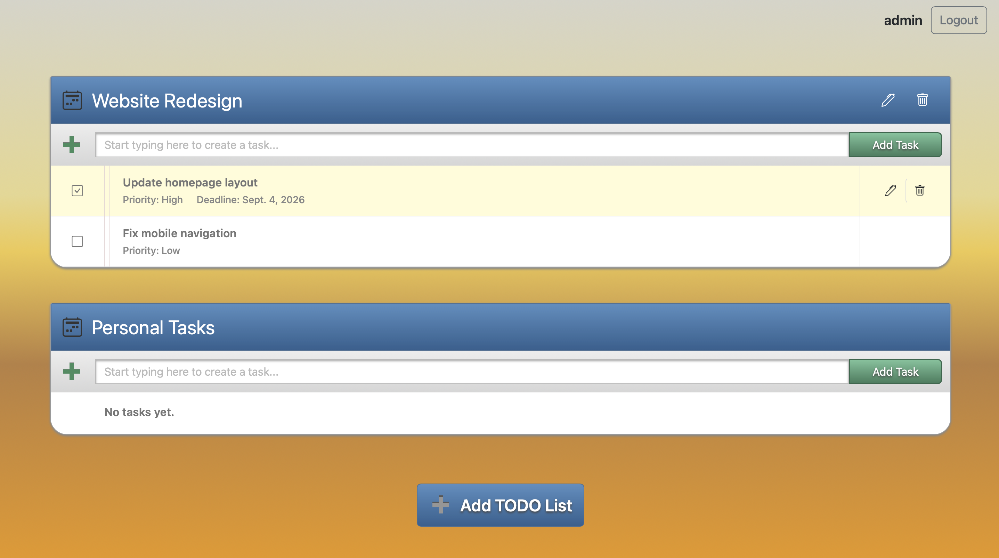

# Task Manager

Task Manager is a web application for organizing personal projects and keeping track of everyday tasks.

The application allows users to create separate projects, add tasks to them, set priorities and deadlines, and mark completed work. Project and task management is performed dynamically without unnecessary page reloads, making the interface simple and convenient to use.

Each user has a personal account and can access only their own projects and tasks. The application also includes responsive layouts for desktop and mobile devices, form validation, and authentication.

## Live Demo

The deployed version of the application is available online and can be tested directly in the browser:

[Open Task Manager](https://task-manager-u1rn.onrender.com)

You can create an account, sign in, create projects and tasks, and try the main functionality of the application.

## Application Preview



## Features

The application includes the main functionality required for managing projects and their tasks:

- User registration and authentication
- Create, update, and delete projects
- Create, update, and delete tasks
- Set task priority
- Set task deadline
- Mark tasks as completed
- User-specific projects and tasks
- Dynamic updates without page reloads
- Responsive layout for desktop and mobile
- Client-side and server-side validation

## Tech Stack

The project is built with Django and uses a small set of frontend technologies to provide dynamic interactions without turning the application into a separate frontend project.

- Python 3.13
- Django 5.2
- PostgreSQL
- Docker Compose
- Bootstrap 5
- HTMX
- Alpine.js
- hyperscript
- django-allauth
- WhiteNoise
- Gunicorn
- Ruff
- pre-commit

## Local Setup

The project can be started locally with Docker Compose. Docker runs both the Django application and PostgreSQL database, so PostgreSQL does not need to be installed separately on the host machine.

### 1. Clone the repository

```bash
git clone https://github.com/anastasiiaoshega513/task-manager.git
cd task-manager
```

### 2. Create environment variables

Create a local `.env` file from the provided sample:

```bash
cp .env.sample .env
```

Open `.env` and replace the placeholder values with your local configuration.

The `.env` file contains configuration required by Django and PostgreSQL and is not committed to the repository.

### 3. Build and start the containers

Build the Docker images and start the application:

```bash
docker compose up --build -d
```

This command starts the Django application and PostgreSQL database in separate containers.

### 4. Apply database migrations

After the containers are running, apply Django migrations:

```bash
docker compose exec web python manage.py migrate
```

This creates all required database tables.

### 5. Open the application

The application will be available at:

```text
http://localhost:8000
```

Create an account or sign in to start creating projects and managing tasks.

## Stop the Application

To stop the running containers:

```bash
docker compose down
```

To stop the containers and also remove the local PostgreSQL volume and all stored database data:

```bash
docker compose down -v
```

## Code Quality

The project uses Ruff for linting and formatting together with pre-commit hooks. This helps keep the code style consistent and automatically checks changes before they are committed.

Install the Git hooks:

```bash
pre-commit install
```

Run all configured checks manually:

```bash
pre-commit run --all-files
```

## SQL

The repository also contains solutions to the additional SQL exercises.

They are available in [`SQL.md`](SQL.md).

## Deployment

The production version of the application is deployed as a web service on Render.

Gunicorn is used to run the Django application in production, while WhiteNoise is responsible for serving static files. The production PostgreSQL database is hosted on Neon.

The deployment is connected to the `main` branch of the repository, allowing new changes to be deployed automatically after they are merged and pushed.